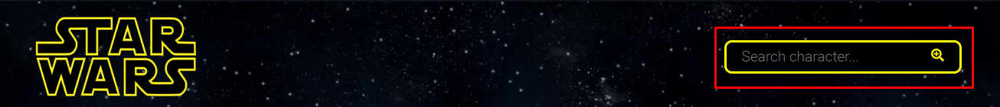
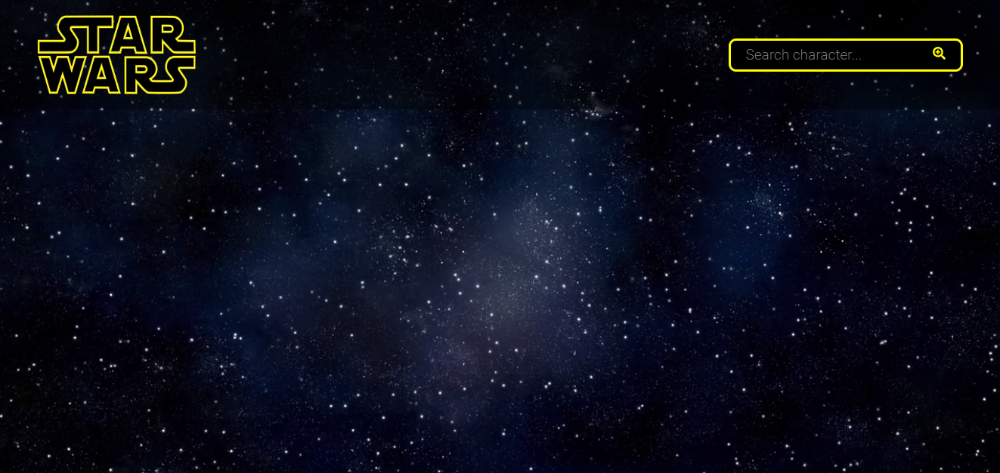
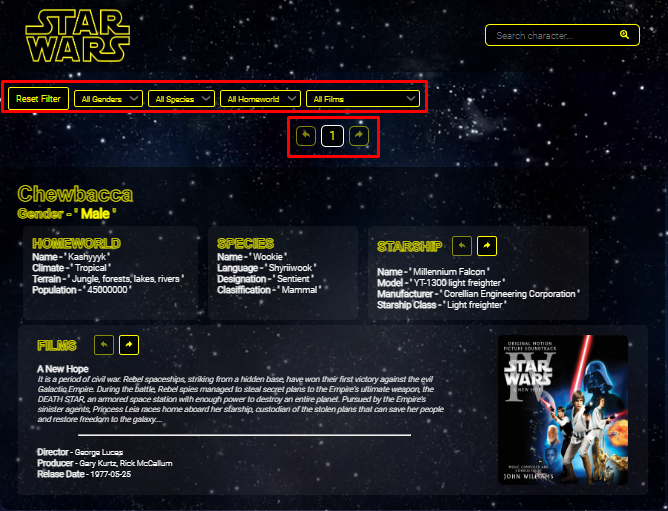
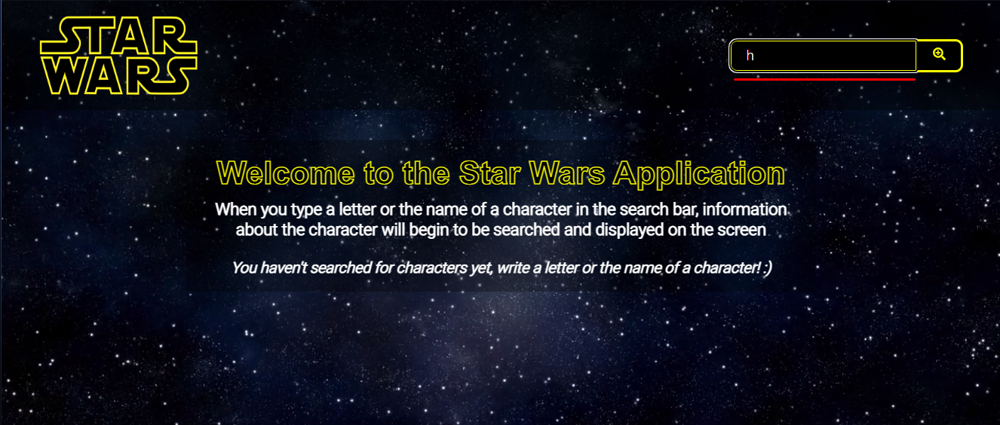
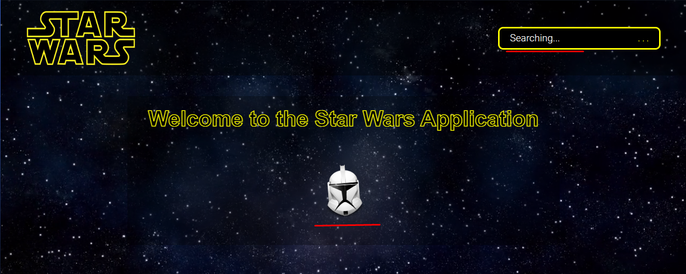
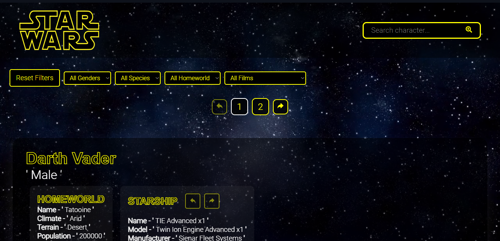
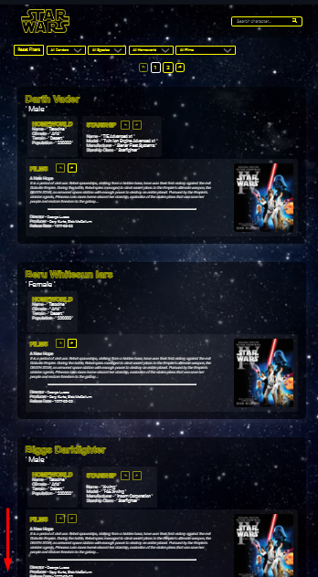

# STAR WARS SWAPI

Deploy: **[Star Wars Swapi Challenge](https://star-wars-swapi-challenge.vercel.app)**

<em>
It is an application which allows you to search for characters from the Star Wars Universe, and be able to see the details of each of the characters.
</em>
1. At first there will be no character, since it will be waiting for the user to enter the name of a character or even a single letter will be enough to search for a variety of characters that include that letter.

When you search for a character it can be displayed on the screen, as characters are added there will be more options in the filters.
<em>
It should be noted that 5 characters will be shown per page, so it has pagination
</em>

## EXAMPLE

1. Search

2. Loading

3. Characters

## More Information

If the repository is cloned, the <code>npm start</code> command must be executed, since it must install dependencies and so on.

<code>/src/api/index.js</code>

In the 'api' folder it simulates a BackEnd. It was done that way since it was shown that it would be more convenient to obtain the information that way.

<code>/src/store/StoreReducer.js</code>

Among the properties of InitialState, there are two properties marked on the image, which are to define the number of characters per page and the initial index

<em>React, Javascript, CSS, AOS, Axios, SweetAlert were used for this project</em>
